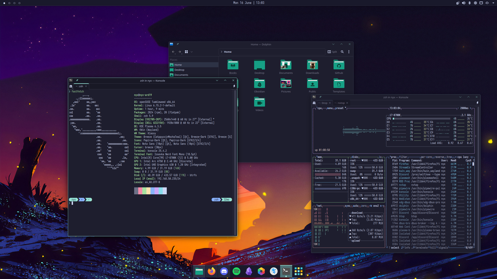

I like my mess of a desktop. This repo is where I keep the config. I like to have a hybrid floating
and stacking workflow in my desktop environment. [COSMIC](https://system76.com/cosmic/) could be my
dream desktop but I can't justify using something still in alpha, so I'm sticking with
[KDE Plasma](https://kde.org/plasma-desktop/). What about [GNOME](https://www.gnome.org/)? I just
don't like its uncompromising nature.

My terminal's Oh My Posh theme: [nyxcat.omp.toml](nyxcat.omp.toml)

The wallpaper artist is [Michal Kvac](https://kvacm.carrd.co/)

## Overall Theme

- [Catppuccin](https://github.com/catppuccin/catppuccin)
community-driven pastel theme
- [Papirus Icons](https://github.com/PapirusDevelopmentTeam/papirus-icon-theme)
icon theme
- [Papirus Folders](https://github.com/PapirusDevelopmentTeam/papirus-folders)
makes folders match theme colour
- [Nerd Fonts](https://github.com/ryanoasis/nerd-fonts)
a variety of great fonts complete with symbols
- [Iosevka](https://github.com/be5invis/Iosevka)
font I use for reading and editing

## KDE Plasma 6 Config

- [SaveDesktop](https://github.com/vikdevelop/SaveDesktop)
easy way to export and import desktop configs
- [KZones](https://github.com/gerritdevriese/kzones)
window tiling by mouse draging or keyboard
- [Klassy](https://github.com/paulmcauley/klassy)
fancy window decorations
- [application-title-bar](https://github.com/antroids/application-title-bar)
use with borderless fullscreen

## Terminal

- [Z Shell](https://zsh.sourceforge.io/)
terminal shell
- [zsh-syntax-highlighting](https://github.com/zsh-users/zsh-syntax-highlighting)
Fish-like command highlighting
- [zsh-autosuggestions](https://github.com/zsh-users/zsh-autosuggestions)
Fish-like autosuggestions
- [Oh My Posh](https://github.com/jandedobbeleer/oh-my-posh)
theme your prompt

## Terminal Apps

- [btop](https://github.com/aristocratos/btop)
system monitor
- [nvtop](https://github.com/Syllo/nvtop)
graphics card monitor
- [tmux](https://github.com/tmux/tmux)
terminal multiplexer
- [pipx](https://github.com/pypa/pipx)
python app sandbox
- [fzf](https://github.com/junegunn/fzf)
commandline fuzzy find
- [neovim](https://github.com/neovim/neovim)
code editor
- [atuin](https://github.com/atuinsh/atuin)
fuzzy find command history
- [rclone](https://github.com/rclone/rclone)
sync with cloud storage
- [betterdiscordctl](https://github.com/bb010g/betterdiscordctl)
manage BetterDiscord install (even flatpak)

## Linux Apps

- [Ente Photos](https://github.com/ente-io/ente)
photo backup, storage, and sync
- [Obsidian](https://github.com/obsidianmd/obsidian-releases)
my favourite note-taking app
- [Kate](https://invent.kde.org/utilities/kate)
surprisingly great code editor
- [BetterDiscord](https://github.com/BetterDiscord/BetterDiscord/)
Discord enhancement plugin
- [Krita](https://invent.kde.org/graphics/krita)
best opensource digital painting app
- [OnlyOffice](https://github.com/ONLYOFFICE/DesktopEditors)
most compatible MS Office alternative
- [qpwgraph](https://gitlab.freedesktop.org/rncbc/qpwgraph)
audio i/o management flow graph
- [StreamController](https://github.com/StreamController/StreamController)
Elgato Stream Deck control and plugins
- [Vorta](https://github.com/borgbase/vorta)
drive backup with versioning
- [Warehouse](https://github.com/flattool/warehouse)
flatpak management
- [GearLever](https://github.com/mijorus/gearlever)
easy appimage manager

## Non-Linux Apps

- [AffinityOnLinux](https://github.com/Twig6943/AffinityOnLinux)
install and run Affinity Photo on Linux, never use Adobe
